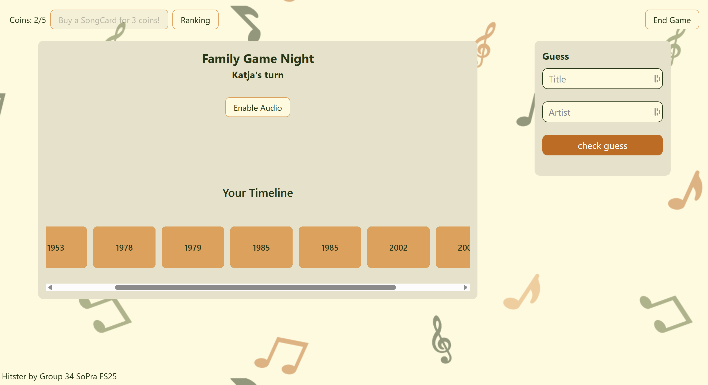

# SoPra FS25 Group 34 Client - Hitster

## Introduction
If you love music, then Hitster is the game for you!
Listen to the greatest hits of the past 80 years with your friends,
and take turns arranging the songs in your timeline in chronological order,
all while taking a trip down memory lane!
<br>
Hitster combines the joy of listening to (mostly) great music and competing with your friends, to see who is the queen/king of music trivia.
And even if the music is not great, you can laugh about it with your friends.
<br>
We developed this digital version of Hitster so you can play with your friends, anywhere and anytime you want.
Nobody needs to own the physical game, you don't need to meet up in person and
by using a streaming service API, you are never going to run out of new songs to keep the game fresh.
This way, we want to make the game as accessible as possible, while still being able to add new features and improvements.
<br>
<br>
The rules are simple:
1. Every player has his own timeline, initiated with one year.
2. Play a snippet of a song for everyone to hear.
3. Everyone can guess title and artist of the song to earn a coin.
4. Place the song in the correct position in your timeline, based on its release year.
5. Other players can challenge your placement if they think it is incorrect and place the card at another
   position.
6. The player that placed the card at the correct position, wins the card and it is placed in their own timeline.
7. For 3 coins, you can buy a card into your timeline. Therefore, it is advantageous to guess title and
   artist correctly.
8. The game ends when the first player reaches 10 cards in their timeline.

The primary goal of our Hitster application is to be fun, user-friendly
and to emulate the experience of playing the physical table-top game, while introducing new features and enhancements.
This includes creating an intuitive and responsive user interface, while also being nice to look at.
Additionally, we need to ensure that the game works on Google Chrome, our target browser.
The biggest upside of our digital version is the unlimited catalogue of songs.
The table-top version of this game contains a limited number of song-cards and can get repetitive after playing it a few times.
By using Apple Music's huge library, our game stays fresh, even after many rounds.

## Table of Contents
1. Introduction
2. Technologies
3. High-level components
4. Launch & Deployment
5. User Interface
6. Roadmap
7. Authors & Acknowledgement
8. License

## Technologies
- TypeScript with React: main programming language
- CSS: styling
- Vercel: handling deployment of client and hosting client
- REST: handling communication between client and server

## High-level components
- [Overview](https://github.com/nicodoukas/sopra-fs25-group-34-client/blob/main/app/overview/page.tsx):
This is the entry page after logging in. From here, the user can access his profile, friend list and open invitations. They can search users, create a lobby and access the game rules.
- [Lobby](https://github.com/nicodoukas/sopra-fs25-group-34-client/blob/main/app/lobby/%5Bid%5D/page.tsx):
The lobby page shows all the members of the lobby and the user's friends, which they can directly invite. This page is already "connected" to websockets to ensure direct updates from a new user joining. The host can start the game from here.
- [Game](https://github.com/nicodoukas/sopra-fs25-group-34-client/blob/main/app/game/%5Bid%5D/gamepage.tsx):
This is the main page of our game. The entire game functionality is handled here. For every round, the active player's timeline is shown, the song can be played by pressing the play button, players can guess the title and artist, the active player can place the song into their timeline etc.
- [Challenge](https://github.com/nicodoukas/sopra-fs25-group-34-client/blob/main/app/game/%5Bid%5D/challenge.tsx):
This page is the second main component of the game. After the active player has confirmed their placement in a round, the challenging phase is initiated. This page is to determine the challenger. The challenger can then set his placement on the next page.
- [WebSocketService](https://github.com/nicodoukas/sopra-fs25-group-34-client/blob/main/app/websocket/websocketService.tsx):
Allows for direct, simultaneous updates across multiple clients. We use it, for example, to play a song at the same time for every player, or to determine who pressed the challenge button first.

## Launch & Deployment
If you are using Windows, you have to install WSL first.
<br>
If you are using MacOS, Linux or WSL, you can skip directly to the setup part


### WSL installation
You might need to reboot your computer for the installation, therefore, save and close all your other work and programs

1. Download the following [powershell script](./windows.ps1)\
   
---
2. Open a new powershell terminal **with admin privileges** and run the following command and follow the instructions. Make sure that you open the powershell terminal at the path where you have downloaded the powershell script, otherwise the command will not work because it can not find the script. You can list currently accessible files in the powershell terminal with ```dir``` and you can use ```cd``` to navigate between directories
   ```shell
   C:\Windows\System32\WindowsPowerShell\v1.0\powershell.exe -ExecutionPolicy Bypass -File .\windows.ps1
   ```
---
3. If you experience any issues, try re-running the script a couple of times. If the installation remains unsuccessful, follow this [youtube tutorial](https://youtu.be/GIYOoMDfmkM) or ask us
---
4. After successful installation, you can open WSL/Ubuntu. You will need to choose a username and password, although no characters will be shown on the screen when typing the password but the system recognizes your input, no worries :) After these four steps your setup should look similar to this
   


<br>

### Setup

You can now clone the repository. After cloning it locally on your own machine, the following steps can be taken to build the application:

1. Inside the repository folder there is a bash script _setup.sh_ that will install everything you need, according to the system you are using. Run the following command and follow the instructions
   ```shell
   source setup.sh
   ```

2. To authorize API requests, one needs to create a `.env.local` file inside the [server directory](https://github.com/nicodoukas/sopra-fs25-group-34-server), which contains the developer token for the Apple Music API.<br>
   ```env
   DEVELOPER_TOKEN="token_here"
   ```
   >**Important**:  
   > Do **not** commit this file to the repository, since it contains sensitive credentials.  
   >To obtain the developer token, please contact one of the project developers listed in the [Authors & Acknowledgement](#authors--acknowledgement) section.

3. Websocket Stuff (Commands to run and files to add)(Nico). Für beidi da eifach gliichi notation wie bi 1. mache.

### After completing these steps, you can use the following commands:

1. **Running the development server** - This will start the application in development mode, meaning that changes to the code are instantly visible live on [http://localhost:3000](http://localhost:3000) in the browser
   ```bash
   deno task dev
   ```
2. **Building a production-ready application** - This will create an optimized production build that is faster and takes up less space. It is a static build, meaning that changes to the code will only be included when the command is run again
   ```bash
   deno task build
   ```
3. **Running the production application** - This will start the optimized production build and display it on [http://localhost:3000](http://localhost:3000) in the browser. This command can only be run _after_ a production build has been created with the command above and will not preview live code changes
   ```bash
   deno task start
   ```
4. **Linting the entire codebase** - This command allows to check the entire codebase for mistakes, errors and warnings
   ```bash
   deno task lint
   ```
5. **Formatting the entire codebase** - This command will ensure that proper indentation, spacing and further styling is applied to the code. This ensures that the code looks uniform and the same across your team members, it is best to run this command _every time before pushing changes to your repository_!
   ```bash
   deno task fmt
   ```
For all the above commands, you can also replace ```deno task``` with ```npm run``` to achieve the same functionality.

### Releases

You will work in your own branch, where you can work on your issues locally and freely commit and push to GitHub.
If you want to merge your contributions to the main branch, open a new merge request for other group members to check out and accept.

## User interface
The following screenshots show the most a walkthrough of our application:

<p float="left">
  
  
  
</p>

<p align="center">
  <em>Figure 1-3: Landing, Overview and Edit Profile Pages</em>
</p>

<p float="left">
  
  
  
</p>

<p align="center">
  <em>Figure 4-6: Profile, Requests & Invites and Friends Pages</em>
</p>

<p float="left">
  
  
  
</p>

<p align="center">
  <em>Figure 7-9: Lobby, Game and Challenge Decide Pages</em>
</p>

<p float="left">
  
  
  
</p>

<p align="center">
  <em>Figure 10-12: Challenge Placement, Round Summary and Game Pages</em>
</p>

<p float="left">
  
  
  
</p>

<p align="center">
  <em>Figure 13-15: Ranking, Game and Game Over Pages</em>
</p>


## Roadmap
### Our next 3 features to be implemented:
### 1. Global Leaderboard
On the client side, this includes adding a leaderboard component, which will be displayed on the overview page.
A user should be able to switch between different leaderboards, based on these statistics:
- Nr. of Games played
- Nr. of Games won
- Win rate
- Percentage of correct Title & Artist guesses
- Average timeline length at the end of a game
Additionally, the statistics of a user should be displayed on their profile.

### 2. Game History
On the client side, this includes adding a new TSX file that displays the game history of a user and adding a button to access a user's game history on their profile.

### 3. Individual profile picture
On the client side, this includes adding a new element to the profile page that allows file input from the users.
Additionally, on all components where we display the username of a user, add their profile picture next to it.

## Authors & Acknowledgement
- [Julia Würsch](https://github.com/monolino)
- [Anja Lindenmann](https://github.com/AnchaXD)
- [Nico Doukas](https://github.com/nicodoukas)
- [Philip Keller](https://github.com/phikell)

We would like to thank our TA, Diyar Taskiran, for his continuous support throughout the development of this project.
Additional thanks go out to the SoPra FS25 organizing staff for making this project prossible.

## License
[MIT License](https://github.com/nicodoukas/sopra-fs25-group-34-client/blob/main/LICENSE)
